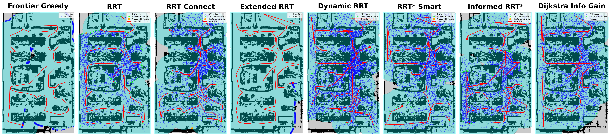
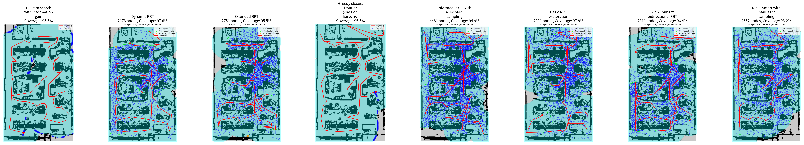

# Multi-Robot-Searching

A real-time semantic SLAM and autonomous exploration framework for quadruped robots.
The system fuses Livox MID360 LiDAR and an FPV camera, builds a semantic occupancy grid
map (rooms / corridors / walls / obstacles), performs onboard ground segmentation, and
runs frontier-based / sampling-based exploration (8 strategies benchmarked) fully aboard
an Agibot D1 Ultra quadruped (Jetson Orin).

## Demo

Eight exploration strategies compared on one real office map (29.2 m × 21.3 m, 623 m²),
20 random-start trials each:



- `result.json` — full statistics of every run
- `coverage_curve.png` — coverage vs. time
- `rrt_tree.png` — constructed sampling tree per strategy

Real-scene ground segmentation models comparison (U-Net vs Footprints vs DeepLabV3+ vs StixelNExT):



## Install

### Requirements

| Component | Source (versions used in this repo) |
|---|---|
| Ubuntu 22.04 + ROS2 Humble | [ros2.org](https://docs.ros.org/en/humble/) |
| NVIDIA Jetson Orin (ARMv8, JetPack R36.5, CUDA 12.6) | [NVIDIA](https://developer.nvidia.com/embedded/jetpack) |
| Livox MID360 LiDAR driver | [Livox-SDK/livox_ros_driver2](https://github.com/Livox-SDK/livox_ros_driver2) |
| FAST_LIO (LiDAR-inertial odometry) | [hku-mars/FAST_LIO](https://github.com/hku-mars/FAST_LIO) (our fork/version lives in [`src/FAST_LIO`](src/FAST_LIO)) |
| Python 3.8+ | [python.org](https://www.python.org/downloads/) |

### Dependencies

```bash
pip install numpy opencv-python torch scipy matplotlib sensor-msgs-py bridge
```

### Installation procedure

```bash
# 1. Clone this repository
git clone https://github.com/wine3603/multi-robot-searching.git
cd multi-robot-searching

# 2. Build the ROS2 workspace (fast_lio + livox_ros_driver2)
#    livox_ros_driver2 must be placed inside src/ (see the link above)
colcon build --symlink-install
source install/setup.bash

# 3. Python dependencies
pip install numpy opencv-python torch scipy matplotlib sensor-msgs-py bridge

# 4. Model weights (gitignored, not shipped)
#    - ground detection:     src/FAST_LIO/scripts/checkpoints_ground/ground_best.pth
#    - semantic segmentation: src/FAST_LIO/scripts/checkpoints/best.pth
#    Train them with the 01-05 / 11-14 script series, or copy from your robot.
```

All shell scripts and Python nodes locate the repository root relative to their own
position (`$(dirname "$0")` / `os.path.dirname(__file__)`), so the package can be
deployed at any path (e.g. `/home/orin-001/sda/agibotnav/`) without editing paths.

## Datasets

- `src/FAST_LIO/scripts/map_data_all/` — annotated grid maps (rooms / corridors / walls /
  obstacles), 5 files per map (`.npy`, `.png`, `_label.npy`, `_meta.json`, `_quads.json`).
  Add your own maps: run `01_save_map.py` while mapping, annotate with `02_annotate.py`.
- `src/FAST_LIO/scripts/ground_data/` — ground training set (images + masks), collected
  with `11_capture_ground.py`, annotated with `12_annotate_ground.py`.

## Running on a Real Robot

```bash
./run.sh
```

Starts, in order: Livox MID360 driver → IMU extrinsic calibration
(`calibrate_imu_extrinsic.py`) → FAST_LIO mapping → `grid_map_generator.py`
(occupancy grid + camera ground segmentation) → `video.py` (RTSP stream publisher).
`Ctrl+C` stops and cleans up all processes.

With health monitoring (auto-restart on failure):

```bash
./run_monitor.sh
```

## Running the Command

### Exploration benchmark (simulation on the live map)

Run all 8 strategies:

```bash
./run_all_experiments.sh
```

Or a single strategy directly:

```bash
python3 src/FAST_LIO/scripts/simulation_explore_framework.py \
    --strategy dynamic_rrt \
    --output-dir experiments \
    --coverage-threshold 0.95 --max-steps 500 \
    --linear-speed 1.0 --angular-speed 1.0
```

Supported strategies: `frontier_greedy`, `rrt`, `rrt_connect`, `extended_rrt`,
`dynamic_rrt`, `rrt_star_smart`, `informed_rrt_star`, `dijkstra_info_gain`.

> The framework subscribes to the `/map` topic (published by `grid_map_generator.py`
> or a recorded rosbag), so start FAST_LIO mapping first, or replay a bag.

### Real-robot frontier exploration

```bash
python3 src/FAST_LIO/scripts/explore_Frontier.py          # frontier-based
python3 src/FAST_LIO/scripts/autonomous_explore.py         # Dynamic-RRT exploration
```

## Citing

If you find this project useful in your research, please consider citing:

> (paper link will be added here — stay tuned)

## Related repositories

- [FAST_LIO](https://github.com/hku-mars/FAST_LIO) — raw LiDAR-inertial odometry
- [PythonRobotics](https://github.com/AtsushiSakai/PythonRobotics) — RRT-family planners (adapted in `src/PathPlanning`)
- [Footprints](https://github.com/nianticlabs/footprints) — traversable space estimation (CVPR 2020), module in `footprints/`
- [GANav-offroad](https://github.com/rayguan97/GANav-offroad) — semantic segmentation on MMSegmentation, module in `GANav-offroad/`
- [StixelNExT](https://github.com/MarcelVSHNS/StixelNExT) — stixel-based ground detection, module in `StixelNExT/`

## License

See the `LICENSE` file in each submodule (`src/FAST_LIO/LICENSE`,
`src/PathPlanning/LICENSE`, `footprints/LICENSE`, `GANav-offroad/LICENSE`, ...).
